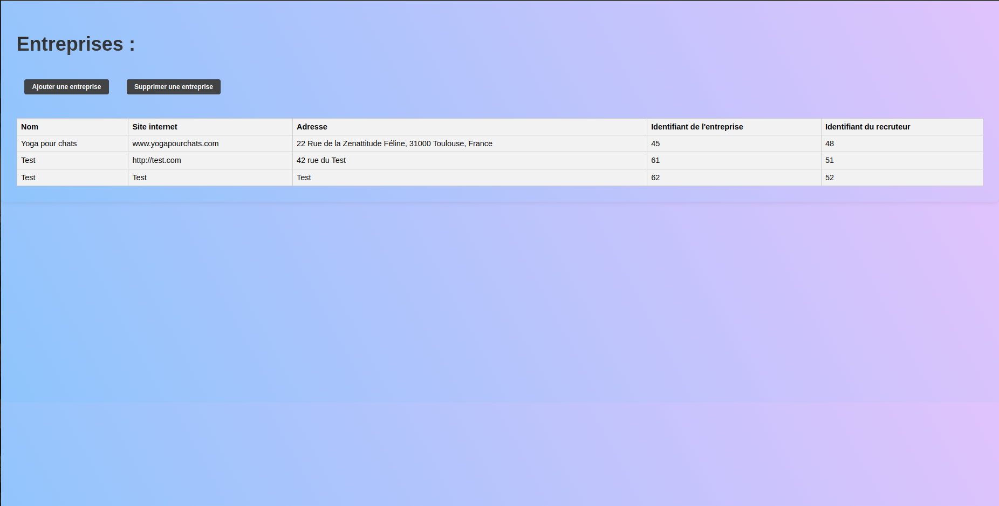

# JobBoard
Projet de JobBoard 


## Introduction
JobBoard est une plateforme qui connecte les candidats à la recherche d'emploi avec les recruteurs. J'ai réalisé ce projet en deux semaines et je me suis principalement consacré au développement de mes compétences en Back-end.


## Fonctionnalités
- **Candidats** : Inscription/connexion, création et modification de profil, consultation des offres d'emploi.
- **Recruteurs** : Inscription/connexion, création de profil entreprise, publication, modification et suppression des offres d'emploi.
- **Monitoring de la Base de Données** : Un système intégré pour surveiller et gérer les données de manière efficace.
  

## Technologies Utilisées
- Front-end: HTML/CSS/JS
- Back-end: Python(FastAPI)
- Base de données: MySQL
  

## Installation

Pour configurer le projet JobBoard sur votre environnement local, suivez ces instructions détaillées.


Clonage du dépôt

Commencez par cloner le dépôt Git avec la commande suivante :

```sh
git clone git@github.com:EpitechMscProPromo2026/T-WEB-501-LYO_14.git
```

Création de la base de données
Veillez à avoir MySQL installé sur votre système. Ouvrez ensuite votre terminal MySQL et exécutez les commandes suivantes pour initialiser votre base de données :

```sh
mysql -u root -p
CREATE DATABASE db_jobboard;
USE db_jobboard;
source database.sql;
```

Installation des dépendances Python
Le projet nécessite l'installation de plusieurs dépendances Python. Installez-les avec la commande suivante :

```sh
pip install fastapi uvicorn mysql-connector-python passlib pydantic python-jose
```

Configuration de la base de données
Avant de lancer l'application, modifiez le fichier db/session.py avec vos propres informations de connexion à la base de données :

```sh
host="localhost", 
user="VOTRE_UTILISATEUR", 
password="VOTRE_MOT_DE_PASSE",
Remplacez VOTRE_UTILISATEUR et VOTRE_MOT_DE_PASSE par vos propres identifiants de connexion.
```

Lancement du serveur
Pour démarrer le serveur FastAPI, utilisez la commande suivante dans le terminal :

```sh
uvicorn main:app --reload
```
Le serveur va démarrer et l'application sera accessible via http://localhost:8000.


## Utilisation

Une fois que vous avez configuré et lancé le JobBoard, vous pourrez accéder aux fonctionnalités suivantes :

Pour les utilisateurs et les organisations

- **Inscription** : Créez un compte en tant qu'utilisateur individuel ou en tant qu'organisation pour commencer à utiliser le JobBoard.
- **Connexion** : Accédez à votre espace personnel pour gérer votre profil et vos annonces.

Gestion des annonces d'emploi

- **Création d'une annonce** : En tant qu'organisation, vous avez la possibilité de créer des annonces d'emploi pour attirer des candidats.
- **Consultation des annonces** : Parcourez toutes les annonces d'emploi disponibles sur la plateforme.
- **Détails d'une annonce** : Consultez les informations détaillées relatives à une offre d'emploi spécifique.

Profils

- **Détails des utilisateurs ou des organisations** : Visualisez les informations de profil des utilisateurs ou des organisations pour en savoir plus sur eux.

Administration

- **Interface d'administration** : À l'adresse `admin.html`, accédez à des outils avancés pour la gestion et la modification de la base de données.
  

## Captures d'écran





